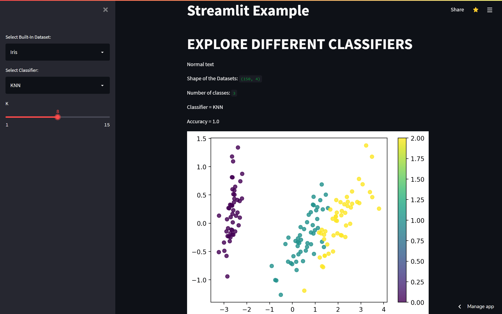
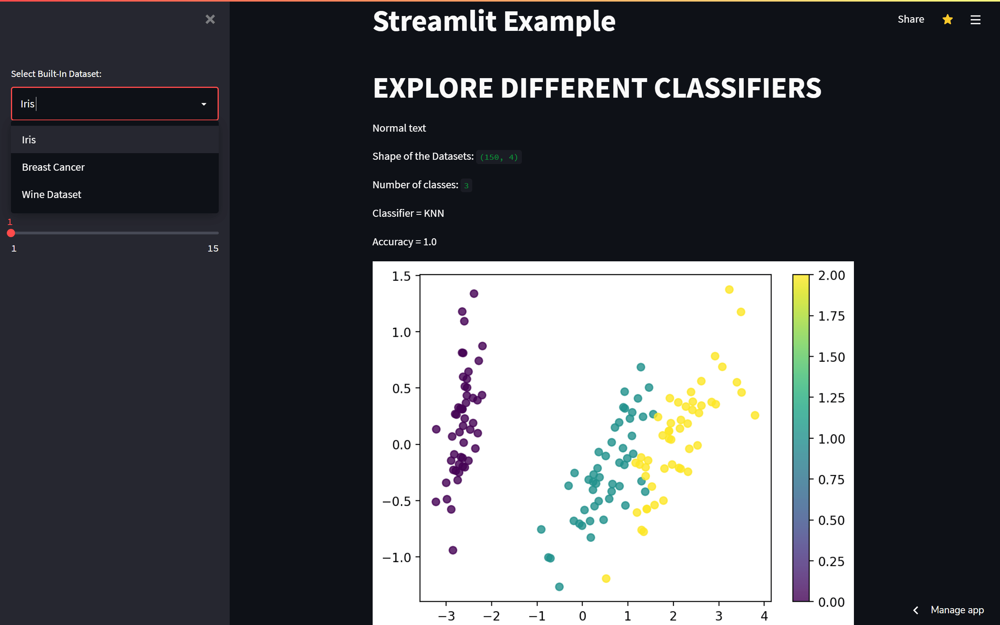
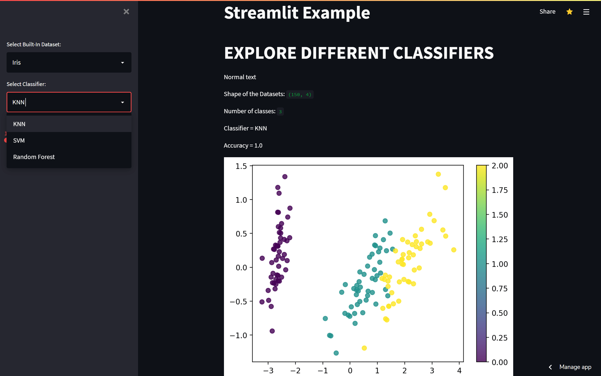

# Real TIme Data Visualisation
> Streamlit webapp to change models and their variables to see the variance in the datasets

See the hosted [webpage](https://share.streamlit.io/vilasrhegde/realtime_data_visualisation/app.py).

## Things used
 - sklearn
 - numpy
 - matplotlib
 - Streamlit

This is the homepage that consist of
- Sidebar
- Shape of dataset
- Classifier name
- Number of Classes
- Accuracy
- Colorbar graph

Here default datasets are given as options to choose any one such as,
- Iris
- Breast Cancer
- Wine dataset
> Based on chosen dataset all the variable will arrange to show the colorbar and outputs

Here 3 different classifiers are given as options such as,
- KNN
- SVM
- Random Forest
> Based on chosen classifier all the variable will arrange to show the colorbar and outputs

Thank you
